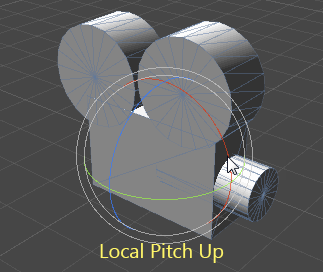

4

As I explained above, this is not an issue with quaternions. Quaternions just represent your rotation.

The problem is that you have mutually conflicting goals for this rotation:

    The camera can look in any direction and always turn left/right/up/down about its own local axes
    The camera never rolls relative to the world up direction

To see why these are contradictory, imagine the following:

    Start with your camera facing north
    Look 90 degrees up (its local up vector/the top of its head is now facing south)
    Look slightly to the right by rotating the camera around its local up vector (as point 1 says we're allowed to do)
    We're now looking slightly east, with our local up vector still pointing straight south. In other words, our viewpoint has a roll of 90 degrees relative to the world up direction! (Violating point 2)

Games usually solve this in two ways:

    For first-person games, camera rotation is often clamped to you can't look a full 90 degrees up or down. Yaw rotation follows the world up axis. (Sacrifice point 1) See this answer for more details

    For free-flying games, the camera lets you look any way you want, and by doing certain moves (like the one above) you can develop some roll in your viewpoint. (Sacrifice point 2) Often these games have an auto-righting feature, where they twist the camera to reduce the roll angle over subsequent frames until you're looking straight upright again.

A neat trick I saw recently in Star Wars Battlefront's fighter battles is that they apply this roll correction only when the player is turning the camera. If you let go of the controls you'll keep whatever roll you have, avoiding the disorienting lurch when the camera twists on its own. For most maneuvers the movement on screen from the player's camera manipulation does a good job of masking the roll correction, so it's hardly noticeable.

So, these are your options. This isn't an artifact of your rotation method or quaternion math, this is just the way rotations in 3D space work, and the best you can do is correct for unwanted roll (gradually, so as not to snap the viewpoint distractingly) or restrict the rotation freedom to avoid it.
